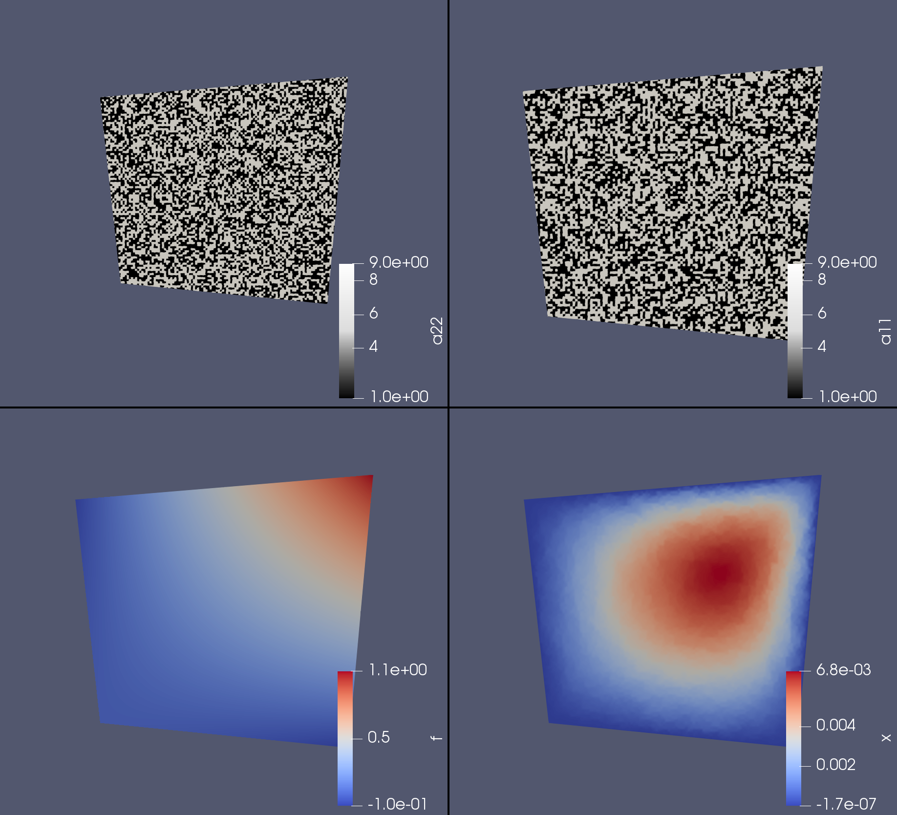

# FEMHomogenization.jl

Some basic FEM functionality in Julia.

The goal is to work on homogenization of elliptic PDEs.

## Example usage

We refine 

```julia
using StaticArrays
using FEMHomogenization: Mesh, Tri, assemble_matrix, assemble_rhs, save_file,
           construct_graph_and_find_interior_nodes, refine, checkerboard

# Build a simple mesh from two triangles
nodes = SVector{2,Float64}[(0.0, 0.0), (1.0, -0.1), (1.1, 1.0), (-0.1, 0.9)]
triangles = SVector{3,Int64}[(1, 2, 3), (1, 4, 3)]
mesh = Mesh(Tri, nodes, triangles)
graph, boundary, interior = construct_graph_and_find_interior_nodes(mesh)

# Uniformly refine the grid a couple times
for i = 1 : 9
    mesh = refine(mesh, graph)
    graph, boundary, interior = construct_graph_and_find_interior_nodes(mesh)
end

# Define a bilinear form and a load function
a11 = checkerboard(100)
a22 = checkerboard(100)
bilinear_form = (u, v, x) -> a11(x) * u.∇ϕ[1] * v.∇ϕ[1] + a22(x) * u.∇ϕ[2] * v.∇ϕ[2]
load = x -> x[1] * x[2]

# Build the matrix and the rhs
A = assemble_matrix(mesh, bilinear_form)
b = assemble_rhs(mesh, load)

# For a Dirichlet zero problem we only need the interior nodes
A_int = A[interior, interior]
b_int = b[interior]

# Solve things
x = zeros(b)
x[interior] .= A_int \ b_int

# Save the load function and solution to a Paraview compatible file
save_file("rhs_and_solution", mesh, Dict(
    "x" => x,
    "f" => load.(mesh.nodes),
    "a11" => a11.(mesh.nodes),
    "a22" => a22.(mesh.nodes),
))
```

Example result:



## Note

This package is a work in progress!